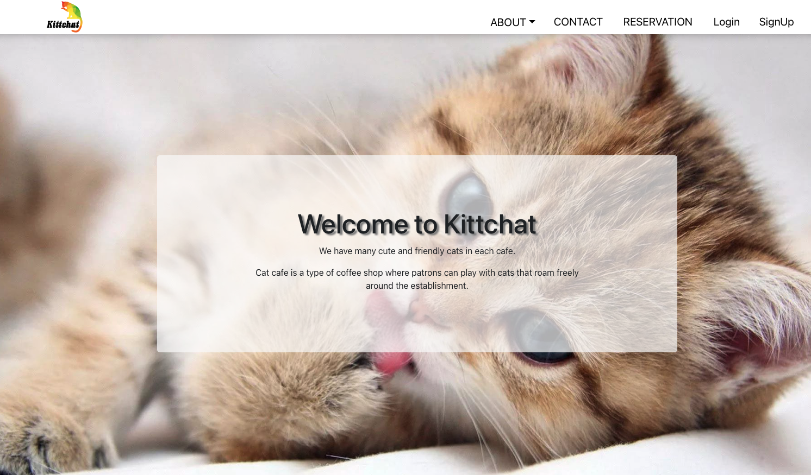

# Kittchat 🐱

## Description

- Kittchat is a Cat Cafe Website where customers can make booking within 5 different locations.

## MVP || Backlog

- [X] Login
- [X] SignUp
- [X] Logout
- [X] SignUp
- [X] Booking site
- [X] Booking history 
- [X] User page
- [X] Admin page

## Models (Server side)

- Reservation.model.js
- User.model.js
- Location.model.js

- Server side code here: https://github.com/LuisaEgoavil/Kittchat-server

## Routes (Client side)

- Home.js
- Cafe.js
- CatInfo.js
- Contact.js
- EditForm.js
- Home.js
- MakeBooking.js
- Profile.js
- Reservation.js
- BookingList.js
____________________________
- Error.js
- Footer.js
- Header.js

- Client side code here: https://github.com/LuisaEgoavil/Kittchat-client

### authentification

- LogIn.js
- SignUp.js

## Built with

## Take a look to our deployed Website!

- Click [here](https://kittchat.herokuapp.com)

